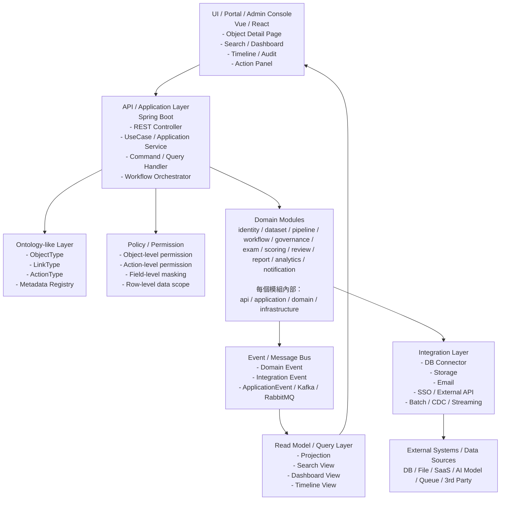
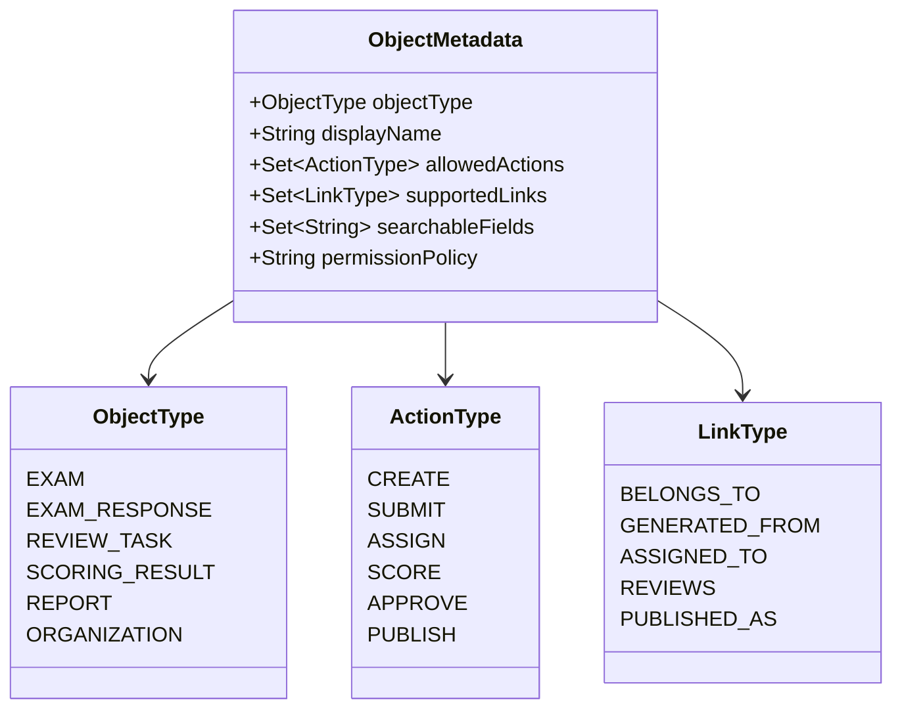
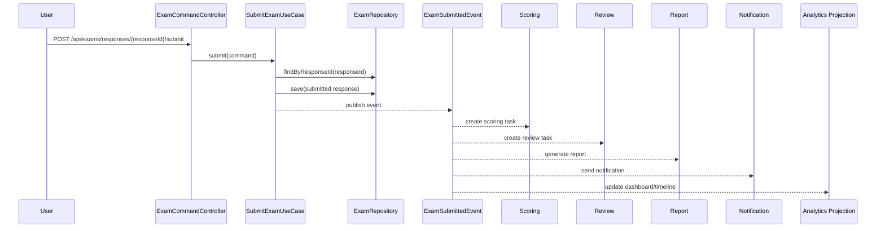
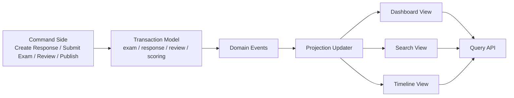

# Foundry-like Platform Skeleton

這是一個以 Spring Boot 建立的 Foundry-like 平台骨架，採用模組化單體架構，目標是先把「業務物件語意化、流程事件化、查詢投影化」這三件事落地。

## 核心概念

- 模組化單體：先把平台切成清楚的業務模組，而不是堆成單一 service layer
- Ontology-like：系統不只存資料，也知道物件是什麼、能做什麼、彼此如何關聯
- Event-driven：流程之間透過事件解耦，方便後續切 MQ 或微服務
- Read model：查詢畫面不直接打交易資料，而是讀 projection / dashboard / timeline

## 專案能力

- Ontology metadata registry
- Exam 模組的 command / query 分離
- 應用內事件流，串接 scoring / review / report / notification / analytics
- Dashboard 與 timeline 的 projection 骨架
- Permission rule 骨架
- Integration gateway 預留層

## 高層架構圖



## Spring Boot 專案結構

```mermaid
flowchart TB
    APP["com.example.platform"]

    SHARED["shared<br/>event / exception / model / security / util"]
    ONTOLOGY["ontology<br/>api / application / domain"]
    IDENTITY["identity<br/>api / application / domain / infrastructure"]
    DATASET["dataset<br/>api / application / domain / infrastructure"]
    PIPELINE["pipeline<br/>api / application / domain / infrastructure"]
    WORKFLOW["workflow<br/>api / application / domain / infrastructure"]
    GOVERNANCE["governance<br/>api / application / domain / infrastructure"]
    EXAM["exam<br/>api / application / domain / infrastructure"]
    SCORING["scoring<br/>api / application / domain / infrastructure"]
    REVIEW["review<br/>api / application / domain / infrastructure"]
    REPORT["report<br/>api / application / domain / infrastructure"]
    ANALYTICS["analytics<br/>api / application / domain / infrastructure"]
    NOTIFY["notification<br/>api / application / domain / infrastructure"]
    INTEG["integration<br/>pubsub / storage / mail / sso / batch / datasource"]

    APP --> SHARED
    APP --> ONTOLOGY
    APP --> IDENTITY
    APP --> DATASET
    APP --> PIPELINE
    APP --> WORKFLOW
    APP --> GOVERNANCE
    APP --> EXAM
    APP --> SCORING
    APP --> REVIEW
    APP --> REPORT
    APP --> ANALYTICS
    APP --> NOTIFY
    APP --> INTEG
```



## 模組說明

### `shared`

放所有模組共用的基礎元件：

- event
- exception
- model
- security
- util

### `ontology`

定義平台語意層：

- `ObjectType`
- `LinkType`
- `ActionType`
- `ObjectMetadata`
- `OntologyRegistryService`

這一層的作用是讓系統理解每個業務物件的型別、可用動作、支援關聯與權限策略。

### `identity`

放使用者、角色、部門、tenant 等身份資料模型，之後可以從這裡擴充到 SSO 與組織權限。

### `dataset`

管理資料集定義、來源系統與版本資訊，對應 Foundry-like 平台中的 dataset registry。

### `pipeline`

管理資料轉換流程與執行紀錄，對應 transform / pipeline orchestration 的最小骨架。

### `workflow`

管理業務 action 與工作流執行紀錄，對應 object action / workflow runtime 的入口。

### `governance`

管理政策、資料範圍與治理規則，作為更完整 permission engine 與 governance 的起點。

### `exam`

目前最完整的示範模組，採用標準分層：

- `api`: HTTP controller
- `application`: command / query / projection
- `domain`: model / event / repository / service
- `infrastructure`: persistence / messaging / config

### `scoring` / `review` / `report` / `notification` / `analytics`

這些模組目前先以事件監聽骨架存在，負責接收 `ExamSubmittedEvent` 後做各自工作。

### `integration`

預留給外部系統整合：

- pubsub
- storage
- mail
- sso
- batch
- datasource

## Ontology 概念圖



## 事件流圖



## 讀寫分離圖



## 啟動方式

```bash
mvn spring-boot:run
```

## 範例 API

- `GET /api/ontology/metadata`
- `GET /api/ontology/metadata/EXAM`
- `GET /api/ontology/metadata/DATASET`
- `POST /api/datasets`
- `GET /api/datasets`
- `POST /api/pipelines/runs`
- `GET /api/pipelines/runs`
- `POST /api/workflows/actions/execute`
- `GET /api/workflows/runs`
- `POST /api/governance/policies`
- `GET /api/governance/policies`
- `POST /api/exams/{examId}/responses`
- `POST /api/exams/responses/{responseId}/submit`
- `GET /api/exams/responses/{responseId}`
- `GET /api/exams/dashboard`
- `GET /api/exams/timeline`

## 目前版本定位

這個版本是 Lite 版 Foundry-like Platform，重點是把架構立起來：

- 先做模組化單體
- 先做應用內事件
- 先做 ontology metadata
- 先做 read model / projection
- 先做 permission skeleton

下一步再逐步補上：

- PostgreSQL / JPA / MyBatis
- 真正的 permission engine
- Search index
- Audit persistence
- Kafka / RabbitMQ / PubSub
- Frontend portal
